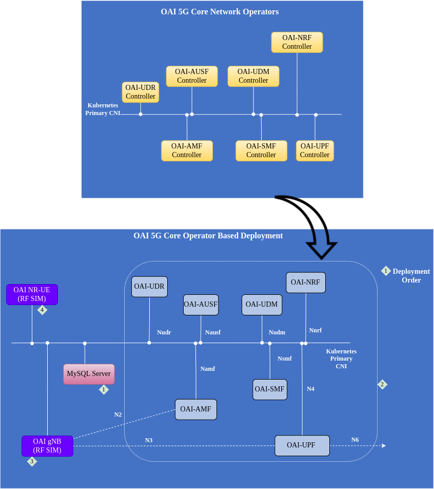

<table style="border-collapse: collapse; border: none;">
  <tr style="border-collapse: collapse; border: none;">
    <td style="border-collapse: collapse; border: none;">
      <a href="http://www.openairinterface.org/">
         
         </img>
      </a>
    </td>
    <td style="border-collapse: collapse; border: none; vertical-align: center;">
      <b><font size = "5">OpenAirInterface 5G Core Network Functions Operator</font></b>
    </td>
  </tr>
</table>

[[_TOC_]]

## 1. Introduction

This repository contains operators for [OpenAirInterface 5G core network functions](https://openairinterface.org/oai-5g-core-network-project/). Each network function has a dedicate operator. The operators are designed for [Nephio](https://nephio.org/), they are listening to the CRDs proposed by Nephio project. 

**TODO**: We are designing our own CRDs to use these operators without Nephio. Once we have our own CRDs we will move this repository under [Openairinterface Orchestration Project](https://gitlab.eurecom.fr/oai/orchestration).

At the moment we offer operators for below network functions:

1. [oai-amf](./operators/amf/README.md)
2. [oai-smf](./operators/smf/README.md)
3. [oai-upf](./operators/upf/README.md)
4. [oai-nrf](./operators/nrf/README.md)
5. [oai-udr](./operators/udr/README.md)
6. [oai-udm](./operators/udm/README.md)
7. [oai-ausf](./operators/ausf/README.md)

oai-udr requires MySQL as database backend to store 5G subscriber data. MySQL is deployed using [helm-charts](./helm-charts/mysql). 

Each operator is using OAI NF tag `v2.0.1`. All the NF images are taken from `docker.io/oaisoftwarealliance`

The repository of each network function operator is organized as below:

```bash
.
├── controllers
│   ├── controller.py (Main controller logic)
│   └── utils.py (Supporting functions)
├── deployment
│   └── nf.yaml (to deploy the operator)
├── Dockerfile  
├── package
│   └── nfdeploy.yaml (Standalone deployment of NF operator)
├── README.md
└── requirements.txt (All the needed python dependencies)
```

The controller for each network function is written using [Kopf: Kubernetes Operators Framework](https://github.com/nolar/kopf). The templates for network function configmap are written using Jinja2 templating package. 

The requirement for each operator 

```bash
jinja2==3.1.2
kopf==1.36.0
kubernetes==26.1.0
```

The operators are tested on Minikube `v1.30.1`, Kubernetes server `v1.26.3` and helm version `v3.11.2`. Helm is only required to instantiate mysql. 

If you want to use minikube as a testing environment then install it from their [website](https://minikube.sigs.k8s.io/docs/start/). In case you are interested you can follow go to the end of this guide to create a minikube cluster with multus CNI enabled.


## 2. Licence info

The source code is written under the 3-Clause BSD License. The text for 3-Clause BSD License is also available under LICENSE file in the same directory. For more details on third party software, please read the NOTICE file in the same directory.


## 3. Functioning of Operators

The controller is listening to nephio proposed crd `workload.nephio.org_nfdeployments.yaml` cluster wide. In the future it will listen to OAI proposed CRDs also. In R2 the crd is common for all the network functions, the provider field is used to identify the network function and its provider.

Controller requires configuration file of the network function and it allows configuring certain config parameters when the controller is deployed. The controller requires two configmaps when running inside a pod or during development phase you can just provide the path of the network function configuration file and the controllers configuration file. Network function configuration file is a jinja2 template. The variable parameters of those fields are filled using `configRef` or `paramRef`. Controller configuration file only contains some constant values for nf `deployment` and resource consumption releated values. In the future these will be calculated dynamically based on the intent. 

The idea of this controller is not to expose multiple configuration paramters but to easily deploy the network function with less efforts from the user. 

There are some environment parameters which are used by the controller to configure network function configuration files. They are present in [utils.py](controllers/utils.py)

```bash
## Example from AMF
TIME_FORMAT = "%Y-%m-%dT%H:%M:%SZ"
KUBERNETES_TYPE=str(os.getenv('KUBERNETES_TYPE','vanilla')).lower()    ##Allowed values VANILLA/Openshift
if KUBERNETES_TYPE not in ['vanilla','openshift']:
    print('Allowed values for kubernetes type are vanilla/openshift')
NF_TYPE=str(os.getenv('NF_TYPE','amf'))      ## Network function name
LABEL={'workload.nephio.org/oai': f"{NF_TYPE}"}   ## Labels to put inside the owned resources
OP_CONF_PATH=str(os.getenv('OP_CONF_PATH',f"/tmp/op/{NF_TYPE}.yaml"))  ## Operators configuration file
NF_CONF_PATH = str(os.getenv('NF_CONF_PATH',f"/tmp/nf/{NF_TYPE}.yaml"))  ## Network function configuration file
DEPLOYMENT_FETCH_INTERVAL=int(os.getenv('DEPLOYMENT_FETCH_INTERVAL',1)) # Fetch the status of deployment every x seconds
DEPLOYMENT_FETCH_ITERATIONS=int(os.getenv('DEPLOYMENT_FETCH_ITERATIONS',100))  # Number of times to fetch the deployment
LOG_LEVEL = str(os.getenv('LOG_LEVEL','INFO'))    ## Log level of the controller
TESTING = str(os.getenv('TESTING','no'))    ## If testing the network function, it will remove the init container which checks for NRFs availability
HTTPS_VERIFY = bool(os.getenv('HTTPS_VERIFY',False)) ## To verfiy HTTPs certificates when communicating with cluster
TOKEN=os.popen('cat /var/run/secrets/kubernetes.io/serviceaccount/token').read() ## Token used to communicate with Kube cluster
KUBERNETES_BASE_URL = str(os.getenv('KUBERNETES_BASE_URL','http://127.0.0.1:8080'))
LOADBALANCER_IP = str(os.getenv('LOADBALANCER_IP',None))
SVC_TYPE = str(os.getenv('SVC_TYPE','ClusterIP')) 
```

AMF/SMF/UPF needs network-attachement-defination for N2/N4/N3 interfaces respectively. Nephio will provide the NAD. Controller is also capable of creating a NAD via changing these fields in [oai5gcore/controllerdeploy/amf.yaml](./oai5gcore/controllerdeploy/amf.yaml) configmap `oai-amf-op-conf`

```bash
    nad:
      parent: 'eth1'   #parent interface on the host machine to create the bridge
      create: False    #If false it will wait for multus defination in the cluster namespace
``` 

In case of docker pull limit on your network better to use pull secrets, just authenticated with the docker hub. You can add the pull secret in the operator configuration amf.yaml in configmap like below

```bash
    imagePullSecrets:
      - name: test
```

At the moment pull secret is only for pulling controller image not `nf` image.

**NOTE**:

1. All the network function controllers except upf and nrf have the same functioning. Though they have a seperate code base but its still similar at the moment.
2. `delete_fn` is not really required at the moment but it is kept for the future if we would like to change something in the network function at time of gracefull deletion
3. In `update_fn` we are rejecting any changes in the metadata field. This is done specially for `annotations`. Probably in the later release we will take these changes in consideration.
4. NRF is the only `nf` at the moment which is exposing its `SBI` via metallb. So it is important to configure the cluster with metallb.git checkout <branch>
cd oai-packages

In case you do not have a working cluster, you can check the last section. 

## 4. Install the Operators




If you are interested in individually testing operators or want to extend their functionality then you should refer to `README.md` files of individual operators. 

Start by cloning this repository

```bash
git clone https://gitlab.eurecom.fr/development/oai-operators.git
# IF NEEDED
git checkout <branch>
cd oai-operators
```

To deploy the whole core network

1. You need to fetch the CRDs from nephio, you can use the script [getcrd.sh](./ci-scripts/getcrd.sh) and install them on the cluster

```bash
./ci-scripts/getcrd.sh
kubectl -f crd/
```

2. Deploy the operator in any namespace you want. Here we will deploy in `oaiops` namespace. 

```bash
kube create ns oaiops
kubectl create -f oai5gcore/controllerdeploy/
```

3. At the moment AMF, SMF and UPF custom resource requires network attachment defination so before creating the custom resource we need to define NAD in a namespace. Here we will use `oai5g` namespace. 

```bash
kube create ns oai5g
kubectl create -f oai5gcore/nad/
```
4. UDR requires an instance of mysql to store the 5G subscriber information, so we need to instantiate a mysql instance. For that we are using helm-charts at the moment. 

```bash
helm install mysql helm-charts/mysql -n oai5g
```

5. Create the custom resources for all core network functions

```bash
kubectl create -f oai5gcore/nfdeploy/
```

6. Most probably you will have a core network configured.

7. Test the core network with gNB and UE you can do 

```bash
## Deploy gNB
helm install gnb helm-charts/oai-gnb
sleep 10
kubectl wait --for=condition=ready pod -l app.kubernetes.io/name=oai-gnb --timeout=5m
## Deploy NR-UE
helm install nrue helm-charts/oai-nr-ue
sleep 10
kubectl wait --for=condition=ready pod -l app.kubernetes.io/name=oai-nr-ue --timeout=5m
sleep 20
```

8. Check if the UE is connected and then ping

```bash
## Check if the UE connects via looking at tunnel interface
kubectl exec -it $(kubectl get pods  -l app.kubernetes.io/name=oai-nr-ue | grep nr-ue | awk '{print $1}') -- ifconfig oaitun_ue1
## ping if it is connected
kubectl exec -it $(kubectl get pods  -l app.kubernetes.io/name=oai-nr-ue | grep nr-ue | awk '{print $1}') -- ping -I oaitun_ue1 10.1.0.1 -c 4
```

## 5. Create A Minikube Cluster (An example)

In VM based minikube we have problems with running `oai-gnb` and `oai-nr-ue` in RFsimulated mode because of the base operating system of minikube VM. So we are using docker in docker based installation. 

```shell
minikube delete
#To create the vm
minikube start --driver=docker --cni=bridge --extra-config=kubeadm.pod-network-cidr=10.244.0.0/16 --cpus=4
git clone https://github.com/k8snetworkplumbingwg/multus-cni.git /tmp/multus
kubectl create -f /tmp/multus/deployments/multus-daemonset-thick.yml
# Enable the metrics server (optional)
minikube addons enable metallb
## Configure metallb in the range you want it will be required by NRF.
# Enable the metrics server (optional)
minikube addons enable metrics-server
```

You can also refer to `./ci-scripts/create-cluster.sh` script.

## 6. End to end test (For testing purpose)

For end to end test the script requires

1. 4 CPU and 16GB RAM
2. Name of the controller image tag for example: develop
3. Name of the parent repository for pushing the images
4. (Optional) User name of the parent repository for pushing the image
5. (Optional) Password of the parent repository to push the image

```bash
time ./ci-scripts/test-end-to-end.sh $TAG $PARENT $USER $PASS
```

# 7. Contribution requests

In a general way, anybody who is willing can contribute on any part of the code in any network component.

Contributions can be simple bugfixes, advices and remarks on the design, architecture, coding/implementation. If you are interested in making a contribution please follow [this document](./CONTRIBUTING.md).